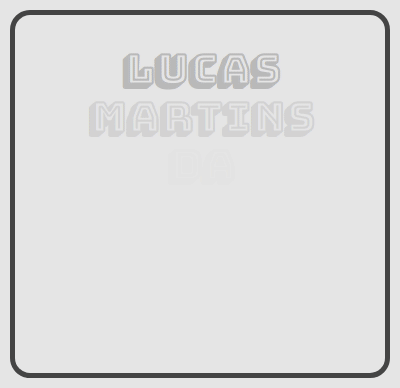

## Olá 👋 Eu sou Lucas Martins!

Paulista, apaixonado pelo desenvolvimento de software (acredite 😉) sempre buscando e aperfeiçoando o conhecimento. Estou aberto a novas oportunidades.
 
 

### 🧐 Mais sobre mim:

<!-- - 🔭 &nbsp; Atualmente, estou trabalhando na ** ** -->
<!-- - 🤝 &nbsp; Estou procurando colaborar no [nome-do-projeto]() -->
- 🌱 &nbsp; No momento estou aprendendo Flutter
<!-- - 🎨 &nbsp; Using [this svg]() and Figma I made 👉 -->
- 📫 &nbsp; Sinta-se à vontade para enviar um email para <lucasmartins.dsilva@gmail.com>
<!-- - 📝 &nbsp; Verifique meu [currículo]() -->
- 📚 &nbsp; Quando tenho tempo livre gosto de programar 👨🏻‍💻 e ouvir podcasts 
 
 

### 🔨 Linguagens e Ferramentas:

 
 
 

### 📊 Status Github

  

⭐️ Baseado em [rahul-jha98](https://github.com/rahul-jha98)

<!-- link abaixo é personalizado para cada usuário em https://yhype.me/ por favor, retire quando clonar! -->

<!-- <a href='https://github.com/lucasmartins96/github-stats-transparent'> -->

<!-- 
 -->

</a>

 

<!-- 
**lucasmartins96/lucasmartins96** is a ✨ _special_ ✨ repository because its `README.md` (this file) appears on your GitHub profile.

Here are some ideas to get you started:

- 🔭 I’m currently working on ...
- 🌱 I’m currently learning ...
- 👯 I’m looking to collaborate on ...
- 🤔 I’m looking for help with ...
- 💬 Ask me about ...
- 📫 How to reach me: ...
- 😄 Pronouns: ...
- ⚡ Fun fact: ...
 -->
